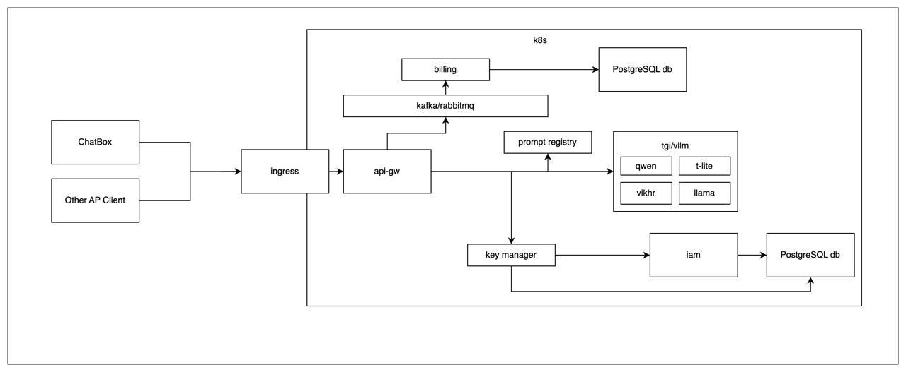

# LLM Serving Framework на Kubernetes

## Обзор

Этот проект представляет собой фреймворк для запуска множества конкурентных LLM (Llama, Mistral или других) моделей в среде Kubernetes.  Он обеспечивает сервис, постоянно работающий в k8s и предоставляющий набор API для систем, требующих ответов в реальном времени.  Фреймворк поддерживает динамическое масштабирование и включает в себя UI для настройки сервиса, документацию API по стандарту OpenAPI, а также локализацию API и лендинга (русский и английский языки).

## Архитектура

Основные компоненты:

*   **ChatBox & Other AP Clients:** Клиенты, отправляющие запросы.
*   **Ingress:** Входная точка в Kubernetes.
*   **api-gw:** API Gateway.
*   **Kafka/RabbitMQ:** Шина сообщений.
*   **Billing:** Компонент биллинга.
*   **Prompt Registry:** Хранилище промптов.
*   **tgi/vllm:** Контейнеры LLM (Qwen, t-lite, vikhr, Ilama).
*   **Key Manager:** Управление ключами.
*   **IAM:** Управление доступом.
*   **PostgreSQL db:** База данных.

## Задачи проекта

*   Формирование Scrum-команды.
*   Реализация сервиса с API.
*   Поддержка ответов в режиме реального времени.
*   Динамическое масштабирование.
*   UI для настройки.
*   Документация API (OpenAPI).
*   Локализация (русский и английский).
*   Подготовка презентации.
